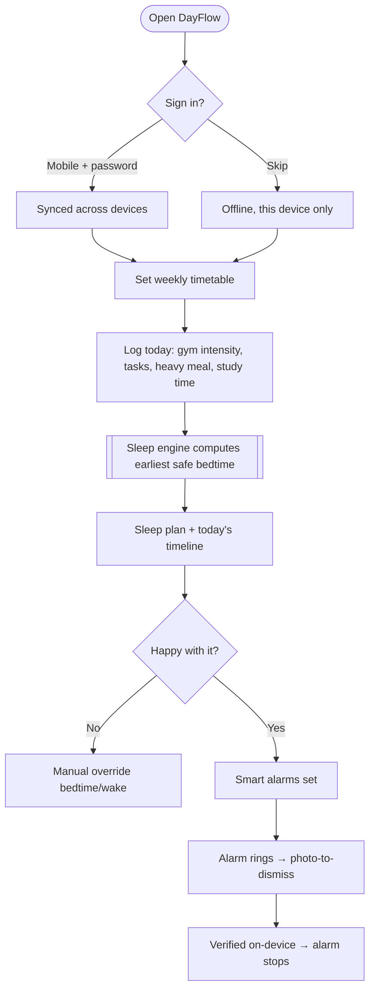
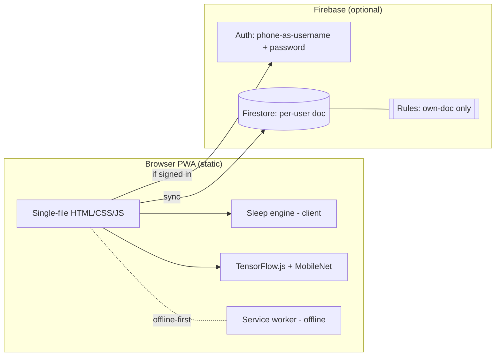
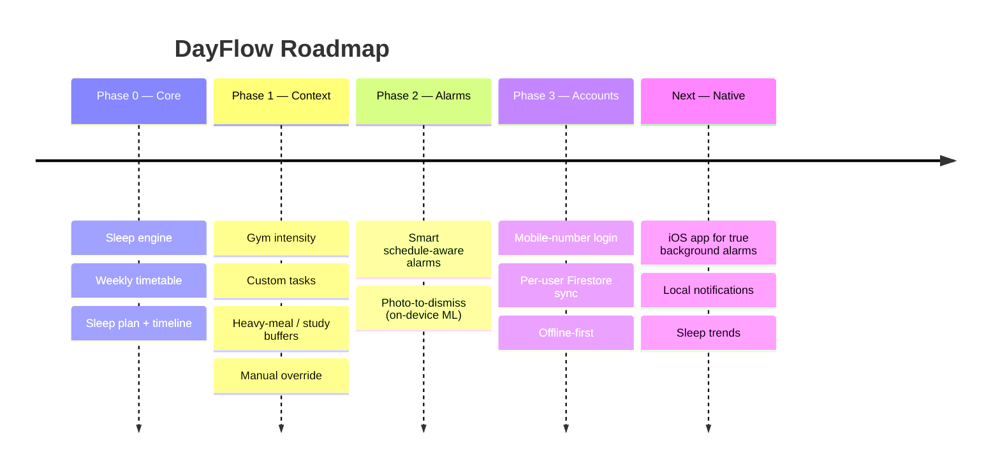
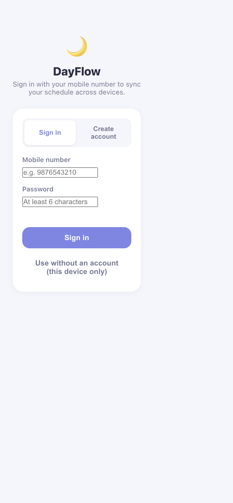
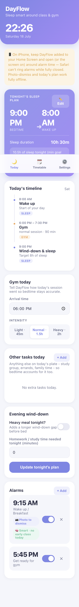

# DayFlow — Product Requirements Document & Case Study

> **Sleep smart around your real day.** A PWA that builds your bedtime and wake time around your class timetable, gym and tasks — so a lighter day earns you *more* sleep, not the same 8 hours.

| | |
|---|---|
| **Live app** | https://aastha381.github.io/DayFlow-Sleep-Planner/ |
| **Repository** | https://github.com/AASTHA381/DayFlow-Sleep-Planner |
| **Author** | Aastha Saini |
| **Status** | Shipped (PWA); native iOS version in progress |
| **Type** | 0→1 consumer health / productivity |
| **Doc version** | 1.0 |

---

## 1. TL;DR (Loom-style walkthrough script)

> *This is DayFlow. Every alarm app just lets you set a time — but the time you *should* sleep changes every day. If you have an early class you need to wind down sooner; if you smashed a heavy gym session or ate late, you need a longer buffer.*
>
> *DayFlow looks at tonight's actual schedule — your class timetable, gym intensity, one-off tasks, even heavy meals — and calculates the earliest safe bedtime that still guarantees your minimum sleep goal. So on a light day it naturally gives you more sleep instead of always exactly eight hours.*
>
> *It also has smart alarms that shift based on whether you have an early class, and a "photo-to-dismiss" mode — you have to photograph a random household object, verified on-device, so you actually get out of bed. It syncs across devices with a mobile-number login, or works fully offline on one device.*

**Elevator pitch:** *An alarm that plans your sleep around your life, not a fixed clock.*

---

## 2. Problem Statement

Sleep advice is generic ("get 8 hours") but **bedtime is a moving target** driven by each day's schedule. Standard alarms are dumb — they set a wake time but ignore what your day actually demands, so students chronically under-sleep or guess.

**The core problem:**
> People don't know *when to go to bed tonight* given their real schedule — so they either under-sleep or rigidly force a fixed time that ignores lighter/heavier days.

**Signals & evidence:**
- Student life = irregular timetables, variable gym, late study — bedtime should flex daily.
- Alarm apps optimise waking, not sleep *planning*.
- "I'll just sleep when I'm done" leads to inconsistent, insufficient sleep.

**Problem hypothesis:**
> If bedtime is computed from tonight's real schedule against a minimum sleep goal, users will hit their sleep target more consistently and feel in control of irregular days.

---

## 3. Research

### 3.1 Method
- **Self + peer empathy** — irregular student schedules.
- **Sleep-hygiene heuristics** — minimum-sleep goals, wind-down gaps after heavy meals/intense exercise.
- **Platform research** — iOS Safari/PWA constraints on background alarms.

### 3.2 Key insights
| # | Insight | Product implication |
|---|---------|---------------------|
| 1 | Bedtime should flex; sleep *minimum* shouldn't. | Compute **earliest safe bedtime**, never cap the max. |
| 2 | Schedule inputs are the real drivers. | Factor **timetable, gym intensity, tasks, meals**. |
| 3 | People snooze through normal alarms. | **Photo-to-dismiss** forces you up. |
| 4 | Early classes change everything. | **Smart alarms** shift with tomorrow's schedule. |
| 5 | iOS can't ring alarms when Safari is closed. | Be **honest about limits**; plan native app. |
| 6 | Some users won't sign up. | Works **offline, single-device, no account**. |

### 3.3 Competitive landscape
| Alternative | Reality | Gap DayFlow fills |
|---|---|---|
| Default clock alarm | Fixed time, no planning | Schedule-aware bedtime |
| Sleep-cycle apps | Track sleep, don't plan tonight | Forward planning from your day |
| To-do / calendar apps | Show events, not sleep math | Turns schedule into a sleep plan |

---

## 4. User Personas

### Primary — "Irregular-schedule Ishita" 🎯
| Attribute | Detail |
|---|---|
| Who | Student with varying classes + gym |
| Pain | Never sure when to sleep; chronically tired |
| Goal | Hit a minimum sleep goal without rigid rules |
| Wins | Auto bedtime that flexes with her day |

### Secondary — "Snooze-addict Sameer" 😴
| Attribute | Detail |
|---|---|
| Pain | Sleeps through alarms, misses class |
| Wins | Photo-to-dismiss makes him physically get up |

### Anti-persona
People with fixed 9–5 routines and consistent sleep — low need for dynamic planning.

---

## 5. Goals & Success Metrics

### North Star Metric
> **Nights the user hits their minimum sleep goal** (planned & followed).

### Supporting metrics (proposed)
| Category | Metric | Target |
|---|---|---|
| Activation | % who set a timetable + first plan | ≥ 60% |
| Core value | Nights plan is generated/used per week | ≥ 5 |
| Alarm efficacy | % alarms dismissed via photo (got up) | ≥ 70% |
| Retention | W4 retention | ≥ 25% |
| Trust | Correct bedtime given inputs (no under-goal plans) | 100% |

### Guardrails
- Never plan below the sleep minimum; per-user data isolation; offline reliability.

---

## 6. Solution & MVP Scope

**Solution:** A mobile-first PWA that converts your timetable + today's context into a concrete bedtime/wake plan and a timeline, with schedule-aware, hard-to-snooze alarms.

### MVP (shipped)
| Capability | Description |
|---|---|
| 🌙 **Dynamic sleep plan** | Earliest safe bedtime respecting a minimum (default 8h) |
| 🗓️ **Weekly timetable** | Editable class schedule, day-by-day |
| 🏋️ **Gym tracking** | Arrival + intensity (light/normal/heavy) → wind-down buffer |
| ✅ **Custom tasks** | One-off tasks with times that factor into the plan |
| 🍽️ **Wind-down factors** | Heavy meal + study-time inputs extend the buffer |
| ✏️ **Manual override** | Type your own bedtime/wake if you disagree |
| ⏰ **Smart alarms** | Auto-shift based on tomorrow's class schedule |
| 📷 **Photo-to-dismiss** | Snap a random household item, verified on-device (TensorFlow.js/MobileNet) |
| 👥 **Multi-user / offline** | Mobile-number login + Firestore sync, or fully offline |
| 📲 **Installable PWA** | Home-screen, offline support |

### Out of scope / known limits (MVP)
- True background alarms (iOS Safari can't ring when closed → native app planned); ring/silent switch is OS-controlled.

---

## 7. User Flow (Flowchart)



### Sleep-engine logic
```mermaid
flowchart LR
    T[Tomorrow's first class] --> WK[Required wake time]
    WK --> BT[Bedtime = wake − max(min sleep, needed)]
    G[Gym intensity] --> BUF[+ wind-down buffer]
    ML[Heavy meal] --> BUF
    HW[Study minutes] --> BUF
    BUF --> BT
    BT --> OUT[Earliest safe bedtime + duration]
```

---

## 8. System Architecture



**Key design decisions**
- **On-device photo verification** (MobileNet in the browser) — no images ever leave the phone (privacy + zero server cost).
- **Optional auth** — works fully offline; sign-in only for cross-device sync.
- **Honest platform limits** — documents iOS background-alarm constraints rather than over-promising; native app is the roadmap answer.
- **Phone-as-username trick** — email/password auth using mobile number to avoid SMS OTP cost.

---

## 9. Wireframe (low-fidelity)

```
┌───────────────────────────────┐
│  🌙 DayFlow          22:26     │
├───────────────────────────────┤
│  Tonight's sleep plan   ✏️Edit │
│   9:00 PM ➜ 8:00 AM  (10h30m) │  ← computed
│  "Light day → more sleep"      │
├───────────────────────────────┤
│  Today's timeline              │
│   • 6:00 Gym (normal, 90m)     │
│   • 9:00 Wind-down & sleep     │
│  Gym today: [Light][Normal][Hvy]│
│  Heavy meal? ☐   Study: [ 0 ]m │
├───────────────────────────────┤
│  Alarms                        │
│   9:15 · 📷 photo · 🧠 smart   │
├───────────────────────────────┤
│  🌙 Today  🗓️ Timetable  ⚙️    │
└───────────────────────────────┘
```

Shipped UI in **Section 11**.

---

## 10. Roadmap



| Phase | Theme | Status |
|---|---|---|
| 0 | Sleep engine + timetable | ✅ Shipped |
| 1 | Contextual inputs | ✅ Shipped |
| 2 | Smart + photo alarms | ✅ Shipped |
| 3 | Accounts + sync + offline | ✅ Shipped |
| Next | Native iOS (background alarms) | 🔜 In progress |

---

## 11. Screenshots

### Sign in (or use offline)


### The daily plan — sleep plan, timeline, gym, alarms


---

## 12. Key Decisions & Trade-offs (PM judgement)

| Decision | Options | Choice & why |
|---|---|---|
| **Bedtime logic** | Fixed 8h vs dynamic | **Dynamic minimum** — lighter days earn more sleep; never below goal. |
| **Alarm dismissal** | Snooze vs task vs photo | **Photo-to-dismiss** — forces physical wake; on-device = private. |
| **Auth** | Required vs optional | **Optional** — offline-first; sync is a bonus, not a gate. |
| **ML placement** | Server vs on-device | **On-device (MobileNet)** — privacy + no infra cost. |
| **Platform** | Native-first vs PWA | **PWA first** to ship fast; native planned for true background alarms. |

---

## 13. What I'd do next (prioritised)

1. **Native iOS app** — the one real limitation: reliable background alarms + local notifications. *(core reliability)*
2. **Sleep-trend insights** — did you hit your goal this week? *(retention)*
3. **Calendar import** — auto-pull timetable instead of manual entry. *(activation)*
4. **Adaptive learning** — learn your actual wind-down time and personalise buffers. *(magic)*

---

## 14. Appendix — Tech at a glance
- **Frontend:** single-file vanilla JS PWA, offline-first service worker.
- **ML:** TensorFlow.js + MobileNet (on-device photo verification).
- **Backend (optional):** Firebase Auth (phone-as-username) + Firestore per-user docs with own-doc rules.
- **Hosting:** GitHub Pages (static). Native iOS (SwiftUI) version in `ios-native/`.
